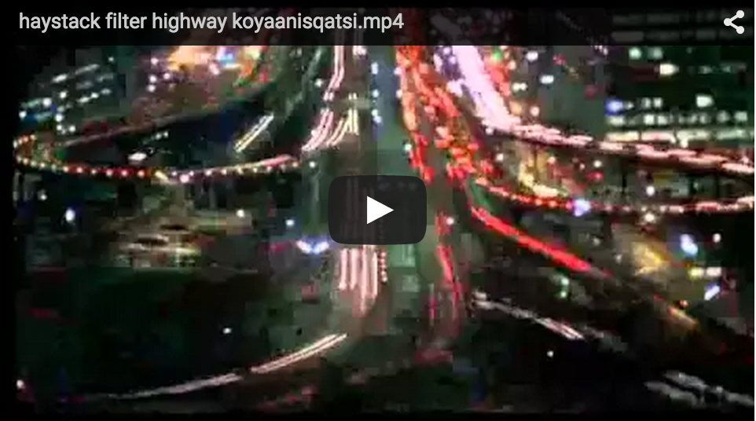

</img>

## Thingscoop: Utility for searching and filtering videos based on their content

### Description

Thingscoop is a command-line utility for analyzing videos semantically - that means searching, filtering, and describing videos based on objects, places, and other things that appear in them.

When you first run thingscoop on a video file, it uses a [convolutional neural network](https://en.wikipedia.org/wiki/Convolutional_neural_network) to create an "index" of what's contained in the every second of the input by repeatedly performing image classification on a frame-by-frame basis. Once an index for a video file has been created, you can search (i.e. get the start and end times of the regions in the video matching the query) and filter (i.e. create a [supercut](https://en.wikipedia.org/wiki/Supercut) of the matching regions) the input using arbitrary queries. Thingscoop uses a very basic query language that lets you to compose queries that test for the presence or absence of labels with the logical operators `!` (not), `||` (or) and `&&` (and). For example, to search a video the presence of the sky *and* the absence of the ocean: `thingscoop search 'sky && !ocean' <file>`.

Right now two models are supported by thingscoop: `vgg_imagenet` uses the architecture described in ["Very Deep Convolutional Networks for Large-Scale Image Recognition"](http://arxiv.org/abs/1409.1556) to recognize objects from the [ImageNet](http://www.image-net.org/) database, and `googlenet_places` uses the architecture described in ["Going Deeper with Convolutions"](http://arxiv.org/abs/1409.4842) to recognize settings and places from the [MIT Places](http://places.csail.mit.edu/) database. You can specify which model you'd like to use by running `thingscoop models use <model>`, where `<model>` is either `vgg_imagenet` or `googlenet_places`. More models will be added soon.

Thingscoop is based on [Caffe](http://caffe.berkeleyvision.org/), an open-source deep learning framework.

### Installation

1. Install ffmpeg, imagemagick, and ghostscript: `brew install ffmpeg imagemagick ghostscript` (Mac OS X) or `apt-get install ffmpeg imagemagick ghostscript` (Ubuntu).
1. Follow the installation instructions on the [Caffe Installation page](http://caffe.berkeleyvision.org/installation.html). 
2. Make sure you build the Python bindings by running `make pycaffe` (on Caffe's directory).
3. Set the environment variable CAFFE_ROOT to point to Caffe's directory: `export CAFFE_ROOT=[Caffe's directory]`.
4. Install thingscoop: `easy_install thingscoop` or `pip install thingscoop`.

### Usage

#### `thingscoop search <query> <files...>`

Print the start and end times (in seconds) of the regions in `<files>` that match `<query>`. Creates an index for `<file>` using the current model if it does not exist.

Example output:

```
$ thingscoop search violin waking_life.mp4
/Users/anastasis/Downloads/waking_life.mp4 148.000000 162.000000
/Users/anastasis/Downloads/waking_life.mp4 176.000000 179.000000
/Users/anastasis/Downloads/waking_life.mp4 180.000000 186.000000
/Users/anastasis/Downloads/waking_life.mp4 189.000000 190.000000
/Users/anastasis/Downloads/waking_life.mp4 192.000000 200.000000
/Users/anastasis/Downloads/waking_life.mp4 211.000000 212.000000
/Users/anastasis/Downloads/waking_life.mp4 222.000000 223.000000
/Users/anastasis/Downloads/waking_life.mp4 235.000000 243.000000
/Users/anastasis/Downloads/waking_life.mp4 247.000000 249.000000
/Users/anastasis/Downloads/waking_life.mp4 251.000000 253.000000
/Users/anastasis/Downloads/waking_life.mp4 254.000000 258.000000
```

####`thingscoop filter <query> <files...>`

Generate a video compilation of the regions in the `<files>` that match `<query>`. Creates index for `<file>` using the current model if it does not exist.

Example output:

<a href="https://www.youtube.com/watch?v=qe9GjrUJipY"></img></a>

#### `thingscoop sort <file>`

Create a compilation video showing examples for every label recognized in the video (in alphabetic order). Creates an index for `<file>` using the current model if it does not exist.

Example output:

<a href="https://www.youtube.com/watch?v=o0VoyJgPgJE"></img></a>

#### `thingscoop describe <file>`

Print every label that appears in `<file>` along with the number of times it appears. Creates an index for `<file>` using the current model if it does not exist.

#### `thingscoop preview <file>`

Create a window that plays the input video `<file>` while also displaying the labels the model recognizes on every frame.

```
$ thingscoop describe koyaanisqatsi.mp4 -m googlenet_places
sky 405
skyscraper 363
canyon 141
office_building 130
highway 78
lighthouse 66
hospital 64
desert 59
shower 49
volcano 45
underwater 44
airport_terminal 43
fountain 39
runway 36
assembly_line 35
aquarium 34
fire_escape 34
music_studio 32
bar 28
amusement_park 28
stage 26
wheat_field 25
butchers_shop 25
engine_room 24
slum 20
butte 20
igloo 20
...etc
```

#### `thingscoop index <file>`

Create an index for `<file>` using the current model if it does not exist.

#### `thingscoop models list`

List all models currently available in Thingscoop.

```
$ thingscoop models list
googlenet_imagenet            Model described in the paper "Going Deeper with Convolutions" trained on the ImageNet database
googlenet_places              Model described in the paper "Going Deeper with Convolutions" trained on the MIT Places database
vgg_imagenet                  16-layer model described in the paper "Return of the Devil in the Details: Delving Deep into Convolutional Nets" trained on the ImageNet database
```

#### `thingscoop models info <model>`

Print more detailed information about `<model>`.

```
$ thingscoop models info googlenet_places
Name: googlenet_places
Description: Model described in the paper "Going Deeper with Convolutions" trained on the MIT Places database
Dataset: MIT Places
```

#### `thingscoop models freeze`

List all models that have already been downloaded.

```
$ thingscoop models freeze
googlenet_places
vgg_imagenet
```

#### `thingscoop models current`

Print the model that is currently in use.

```
$ thingscoop models current
googlenet_places
```

#### `thingscoop models use <model>`

Set the current model to `<model>`. Downloads that model locally if it hasn't been downloaded already.

#### `thingscoop models download <model>`

Download the model `<model>` locally.

#### `thingscoop models remove <model>`

Remove the model `<model>` locally.

#### `thingscoop models clear`

Remove all models stored locally.

#### `thingscoop labels list`

Print all the labels used by the current model.

```
$ thingscoop labels list
abacus
abaya
abstraction
academic gown
accessory
accordion
acorn
acorn squash
acoustic guitar
act
actinic radiation
action
activity
adhesive bandage
adjudicator
administrative district
admiral
adornment
adventurer
advocate
...
```

#### `thingscoop labels search <regexp>`

Print all the labels supported by the current model that match the regular expression `<regexp>`.

```
$ thingscoop labels search instrument$
beating-reed instrument
bowed stringed instrument
double-reed instrument
free-reed instrument
instrument
keyboard instrument
measuring instrument
medical instrument
musical instrument
navigational instrument
negotiable instrument
optical instrument
percussion instrument
scientific instrument
stringed instrument
surveying instrument
wind instrument
...

```

### Full usage options

```
thingscoop - Command-line utility for searching and filtering videos based on their content

Usage:
  thingscoop filter <query> <files>... [-o <output_path>] [-m <model>] [-s <sr>] [-c <mc>] [--recreate-index] [--gpu-mode] [--open]
  thingscoop search <query> <files>... [-o <output_path>] [-m <model>] [-s <sr>] [-c <mc>] [--recreate-index] [--gpu-mode] 
  thingscoop describe <file> [-n <words>] [-m <model>] [--recreate-index] [--gpu-mode] [-c <mc>]
  thingscoop index <files> [-m <model>] [-s <sr>] [-c <mc>] [-r <ocr>] [--recreate-index] [--gpu-mode] 
  thingscoop sort <file> [-m <model>] [--gpu-mode] [--min-confidence <ct>] [--max-section-length <ms>] [-i <ignore>] [--open]
  thingscoop preview <file> [-m <model>] [--gpu-mode] [--min-confidence <ct>]
  thingscoop labels list [-m <model>]
  thingscoop labels search <regexp> [-m <model>]
  thingscoop models list
  thingscoop models info <model>
  thingscoop models freeze
  thingscoop models current
  thingscoop models use <model>
  thingscoop models download <model>
  thingscoop models remove <model>
  thingscoop models clear

Options:
  --version                       Show version.
  -h --help                       Show this screen.
  -o --output <dst>               Output file for supercut
  -s --sample-rate <sr>           How many frames to classify per second (default = 1)
  -c --min-confidence <mc>        Minimum prediction confidence required to consider a label (default depends on model)
  -m --model <model>              Model to use (use 'thingscoop models list' to see all available models)
  -n --number-of-words <words>    Number of words to describe the video with (default = 5)
  -t --max-section-length <ms>    Max number of seconds to show examples of a label in the sorted video (default = 5)
  -r --min-occurrences <ocr>      Minimum number of occurrences of a label in video required for it to be shown in the sorted video (default = 2)
  -i --ignore-labels <labels>     Labels to ignore when creating the sorted video video
  --title <title>                 Title to show at the beginning of the video (sort mode only)
  --gpu-mode                      Enable GPU mode
  --recreate-index                Recreate object index for file if it already exists
  --open                          Open filtered video after creating it (OS X only)
```

### CHANGELOG

#### 0.2 (8/16/2015)

* Added `sort` option for creating a video compilation of all labels appearing in a video
* Now using JSON for the index files

#### 0.1 (8/5/2015)

* Conception

### License

MIT
